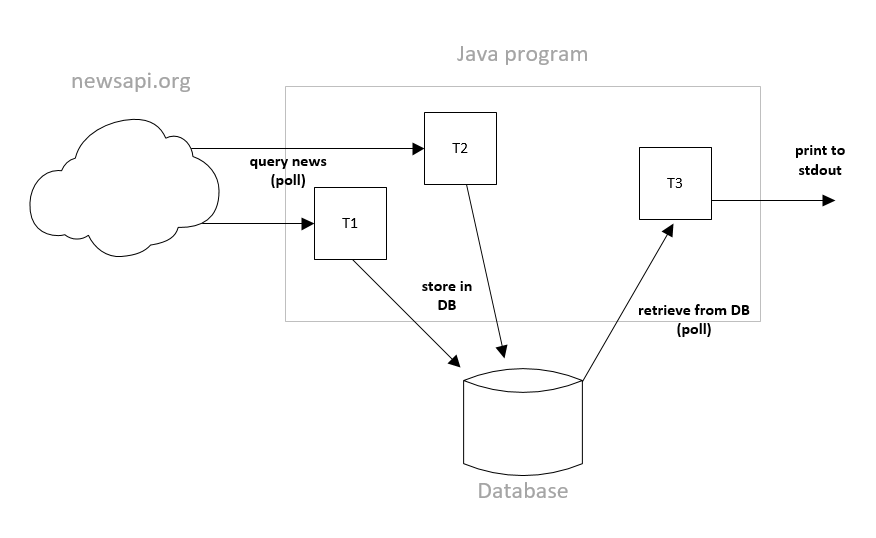

# Craft-IT Coding Challenge "JAVA News API"

_Weekend, Jul 14 to Jul 16 2017_

__Receive €150 for a weekend of programming!__

_All_ the best selected submissions receive the money.

## Scope and Goal

This challenge is about dealing with a REST API and Java Threads!
The scope is to show basic understanding of multithreading in Java. In addition, it requires you to know how to interact with APIs, from data retrieval to storage.
The challenge takes a seasoned developer around 1-2 hours of work, until a meaningful result is achieved.

The goal is to create a java command line tool which fetches the newest headlines from the newsapi.org API, stores them into a database and prints title and date-published of them to stdout.
The following threading model should be implemented:




Requirement:
* Use at least two threads or more (T1, T2, … Tn) to retrieve news from two different sources newsapi.org provides and save the results to a database of your choice (i.e. MySql, MongoDB, Redis, SQLite, …). The results of the API are JSON formatted and has a very simple structure.
* Use another thread (T3) to poll the database for new results and print them to stdout (date-published + title). I.e.: “2017-07-12 Protests in Hamburg during G20”
* Writing and reading from the database must happen in separate threads. Threads which query the newsapi.org API should not print results to stdout.
* Do not block the main thread.
* The following things should be configurable using a config file or command line parameters:
  * API key
  * News sources of the different query-threads
  * (Bonus task: Filter keywords)
* Poll the API and the database at least every 5 seconds.
* Delete all existing entries from the database on startup.


Bonus:
Provide a filter mechanism based on keywords to filter the results which are be printed to stdout. For example, you could add additional command line arguments or extend the config file so that the user can specify keywords which must occur in the title/text of the news entries displayed.

Hints:

1. A possible config file could look like this (i.e. JSON, including bonus task):
```
{
  apiKey: ”API KEY”,
  sources: [
    “die-zeit”,
    “al-jazeera-english”
  },
  keywords: [
    “Trump”,
    “Hamburg”,
    “G20”
  }
}

```

The program to be created could behave like the following using this config file:
* 2 query-threads (T1, T2) are started, one polling results from source “die-zeit” and the other one from “al-jazeera-english” in a regular interval. All fetched results are stored in the database by those threads.
* The retrieving-thread (T3) will print entries which contain the configured keywords in title and/or content.

2. Getting an API key from https://newsapi.org is done within seconds – it’s a free to use API and very well documented! Besides that, it’s the simplest API we have ever seen ;-). The following is an example URL to query Al Jazeera headlines:
```
https://newsapi.org/v1/articles?source=al-jazeera-english&sortBy=top&apiKey=<your_key_here>
```

## Rules to get the bounty
The following is a requirement:

* Use Java
* You can use any framework and development environment that you like
* When finished, publish your work somewhere on github
* Do it __on your own__ - this is not a group task
* and submit it __not later than July 16, 23:59:59 CEST__ and notify thomas@craft-it.co or add tomw1808 to your github/bitbucket!
* When your code is selected as one of the winners, you have to come in and prove it during a code review
* Be (at least) open to a fulltime/parttime position in our team __and take part in an interview__. You receive the bounty no matter if you are really becoming a team-member or not.
* You are not working for us and you have not participated in any of our coding challenges before
* By participating you accept that sending out invitations on submissions is at Craft-IT’s solely discretion. No submissions will be accepted later than the deadline given above!

## Rules to get an awesome Job

* Deadline: July 23, 23:59:59 CEST
* Same rules as above: Do it on your own, make it work, prove it in a code-review, get a well paid job and work with a great Team!


## Where to start / What to expect?

The challenge takes a seasoned developer around 3-4 hours of work, until a meaningful result is achieved.

You can use any framework/library you feel is suitable.

We are looking into your code the following week/weeks and get back to you as soon as possible. We are all just humans here, so please add any documentation/instruction in a way that we understand it. If it's too complicated to install: consider it a fail.


## About us
[Craft IT](http://www.craft-it.co/) is a small boutique web development company located in Graz, Austria. We are passionate full-stack developers and serve international clients, with a focus on financial and analytics applications. We do work with a number of APIs from e.g. cloud accounting providers. We mostly do very custom tailored software which (more often than not) exceeds the possibilities of existing frameworks and libraries.

We are looking for new team-members who love hands-on, enjoy great teams, long term projects, a fun work-environment, tabletennis and coffee (not a must, we also have tee).

If you are looking for a job, this is the kind of work you can expect with us. If you want to join us, here's your chance (or send us your CV)!
